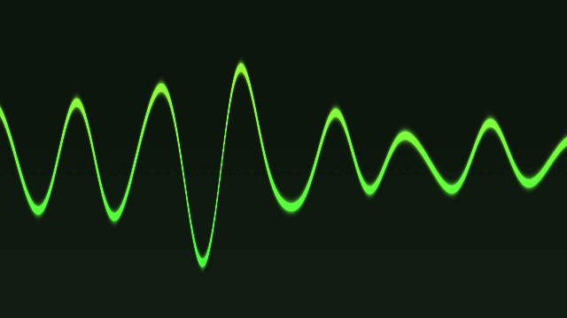
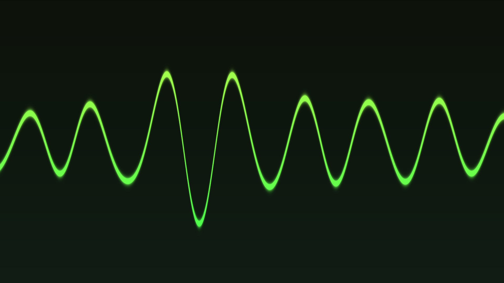
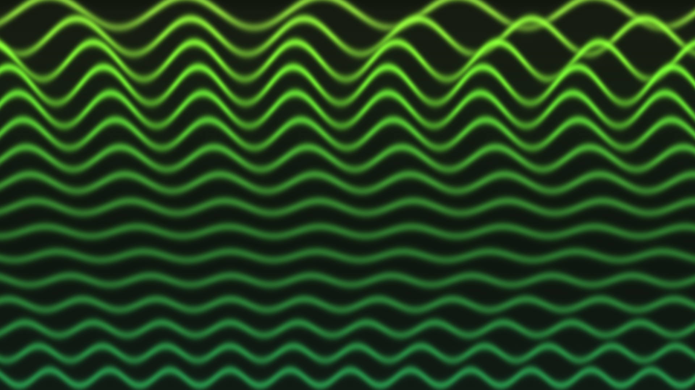

# cosmic-audio-bg

[](LICENSE)


Audio-reactive animated desktop background for **Pop!_OS 24.04 COSMIC**.

Renders WGSL shaders on a Wayland layer-shell background surface, driven by real-time FFT analysis of the default audio monitor (`@DEFAULT_MONITOR@` via PipeWire/Pulse).



*Live demo: the `composite` waveform reacting to audio. The two modes below are still frames.*

<table>
  <tr>
    <td width="50%"></td>
    <td width="50%"></td>
  </tr>
  <tr>
    <td align="center"><em><code>composite</code> mode: a single glowing wave that is the superposition of all 16 FFT-band sinusoids.</em></td>
    <td align="center"><em><code>stripes</code> mode (default): 16 horizontal stripes, one continuous sinusoid per FFT band.</em></td>
  </tr>
</table>

## Quick start

```bash
# 1. Dependencies + Rust
chmod +x scripts/*.sh
./scripts/install-deps.sh

# 2. (Optional) Phase 1 prototype with cosmic-ext-bg
./scripts/install-prototype.sh
./scripts/test-prototype.sh

# 3. Build and install custom daemon
./scripts/install-service.sh

# 4. Enable at login (disables stock cosmic-bg)
systemctl --user disable --now com.system76.CosmicBackground.service 2>/dev/null || true
systemctl --user daemon-reload
systemctl --user enable --now cosmic-audio-bg.service
```

## Project layout

```
cosmic-audio-bg/
├── crates/
│   ├── config/     # RON configuration
│   ├── audio/      # PipeWire/Pulse monitor + FFT bands
│   └── daemon/     # Layer-shell + wgpu renderer
├── shaders/        # WGSL wallpapers
├── config/         # Default + per-machine overrides
├── systemd/        # User service unit
└── scripts/        # Install and prototype helpers
```

## Shaders

| File | Purpose |
|------|---------|
| `shaders/sinusoids.wgsl` | Main audio-reactive stacked sine waves (default) |
| `shaders/pulse-aurora.wgsl` | Aurora-style field warp visualization |
| `shaders/idle-ambient.wgsl` | Slow fallback when silent |
| `shaders/spectrum-bars.wgsl` | Optional bar visualization |
| `shaders/pulse-aurora-prototype.wgsl` | Phase 1 cosmic-ext-bg compatible (time only) |

Uniform struct (custom daemon):

```wgsl
struct Uniforms {
    resolution: vec2<f32>,
    time: f32,
    energy: f32,
    levels: array<vec4<f32>, 4>,  // per-band level, 16 bands (~40 Hz–16 kHz)
    phases: array<vec4<f32>, 4>,  // per-band continuously-integrated phase
    mode: u32,                    // 0 = stripes, 1 = composite
}
```

## Visualization modes

`shaders/sinusoids.wgsl` supports two modes, selected by the `visualization`
config field (defaults to `stripes`):

| `visualization` | Behavior |
|-----------------|----------|
| `stripes` (default) | 16 horizontal stripes, one continuous sinusoid per FFT band. |
| `composite` | A single glowing green wave that is the **superposition (sum)** of all 16 band sinusoids: `y(x) = Σ level[b]·sin(spatial_freq[b]·x + phase[b])`, normalized to stay on-screen. One rich composite waveform reflecting the whole spectrum at once. |

Set it in `config/default.ron` (or `~/.config/cosmic-audio-bg/config.ron`), or
per machine in `config/machines/<hostname>.ron`:

```ron
(
    // ...
    visualization: composite,
)
```

Both modes keep the green palette, continuous phase integration, and audio
reactivity. After changing the config, restart the service:

```bash
systemctl --user restart cosmic-audio-bg.service
```

## Choosing a visualization mode

**Right-click anywhere on the wallpaper** to open a small in-place menu and pick
a visualization mode:

| Mode | Description |
|------|-------------|
| `STRIPES` | 16 horizontal stripes, one continuous sinusoid per FFT band (default) |
| `COMPOSITE` | A single glowing wave that is the superposition of all 16 bands |

- The active mode is marked with a green square.
- **Left-click** a row to apply it instantly *and* save it to your config.
- **Esc** or **left-click outside** the menu dismisses it.
- Holding **Super** while right-clicking also works (the modifier is detected,
  but not required).

The selection is persisted to the config file the daemon was started with
(`~/.config/cosmic-audio-bg/config.ron` for the systemd service), so it
survives restarts.

> **Input note:** to receive the right-click, the background layer keeps its
> default (full) input region instead of being fully click-through. On COSMIC,
> empty-desktop clicks are routed to the wallpaper layer. If a future compositor
> swallows background-layer clicks, the same menu could be re-homed onto an
> on-demand `Top` layer surface.

## Multi-machine setup

1. Clone this repo on both Pop!_OS laptops.
2. Copy or rename a machine config:
   - `config/machines/laptop-a.ron`
   - `config/machines/laptop-b.ron`
   - Or create `config/machines/$(hostname).ron`
3. Run `./scripts/install-service.sh` on each machine.

Per-machine overrides: FPS, audio sensitivity, output filter, shader path, visualization mode.

## Power behavior

| State | Behavior |
|-------|----------|
| AC power | `fps_ac` (default 60) |
| Battery | `fps_battery` (default 30) |
| Lid closed | Pauses rendering (if enabled) |
| Silent audio | Fades to idle ambient via `idle_blend` |

## Coexistence with cosmic-bg

`cosmic-bg` and `cosmic-audio-bg` both use the Wayland background layer. Disable one before starting the other:

```bash
systemctl --user stop com.system76.CosmicBackground.service
pkill cosmic-bg
cosmic-audio-bg --config ~/.config/cosmic-audio-bg/config.ron
```

## Development

```bash
source ~/.cargo/env
cargo build -p cosmic-audio-bg
COSMIC_AUDIO_BG_SHADER=shaders/pulse-aurora.wgsl \
  cargo run -p cosmic-audio-bg -- --config config/default.ron
```

Requires an active COSMIC Wayland session.

## License

MIT
